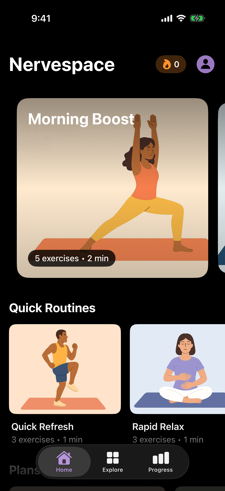
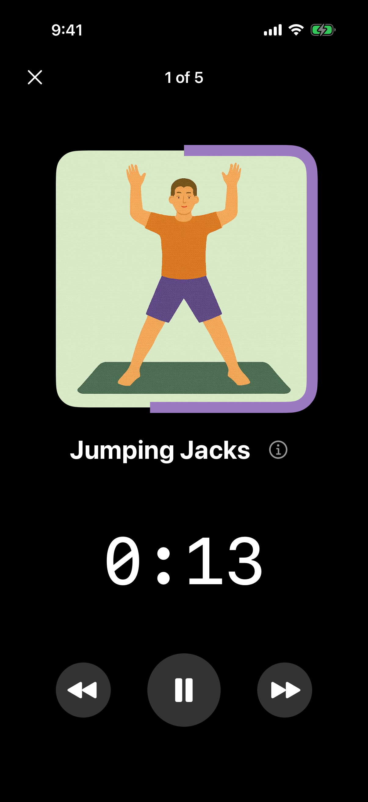
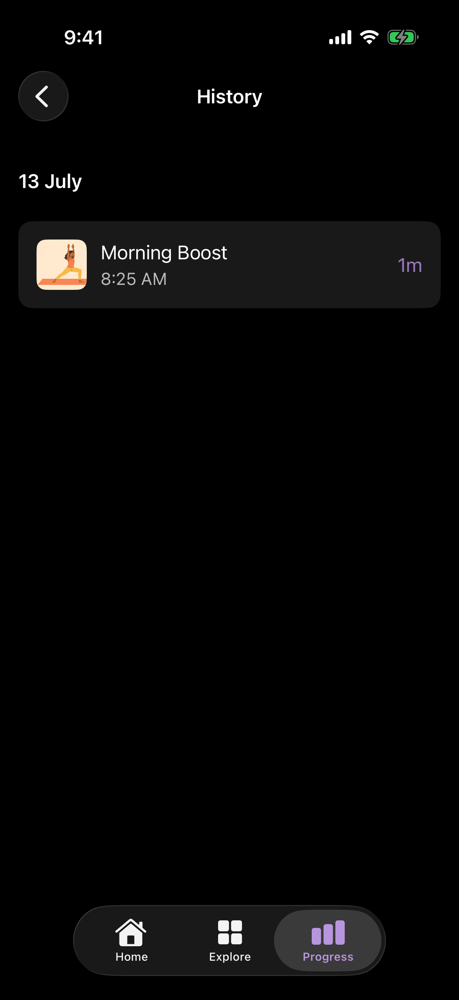

# Nervespace


Nervespace is a SwiftUI app for short movement, stretching, breathing, and recovery routines. Pick a routine, follow the timer, and the completed session appears in progress and history.

Routine history, settings, bookmarks, goals, and reminders stay on the device,
so the app works without signing in.

## Screenshots

| Home | Active session | Local history |
| --- | --- | --- |
|  |  |  |

## Demo

[Watch the 28-second app demo](docs/demo/nervespace-demo.mp4) · [Read the capture notes](docs/demo/README.md)

The clip follows a routine from selection through a saved local history entry.

## What it does

- First-launch onboarding
- 20 bundled exercises, 11 routines, and 4 plan collections
- Home, quick-routine, plan, category, and body-area browsing
- Routine bookmarks and per-exercise duration controls
- Timed sessions with pause, previous, next, and exercise details
- Completion history, daily minutes, a configurable daily goal, and streak tracking
- A repeating local reminder using iOS notifications

## Architecture

Tuist 4.79.3 generates the Xcode workspace from `Project.swift`. The app is split into three targets:

```text
Nervespace
├── App            SwiftUI screens and iOS adapters
├── SharedKit      Bundled content, shared models, and reusable UI
└── LocalDataKit   Completion storage, migration, and progress rules
```

The app has no external package dependencies. Tests are separated into `AppTests`, `SharedKitTests`, `LocalDataKitTests`, and `NervespaceUITests`.

## Local data model

Each completed routine is stored as a `RoutineCompletion` with an ID, routine ID, duration in minutes, and completion date. Completions are written atomically to:

```text
Application Support/Nervespace/routine_completions.json
```

Writes use an atomic file replacement. The reader still accepts the older JSON format so existing installs can migrate. Daily-goal, bookmark, and reminder settings use `UserDefaults`. Progress calculations use a 4:00 a.m. activity-day boundary so a late-night session stays with the intended day.

## Setup

Requirements:

- Xcode with an iOS Simulator
- Tuist 4.79.3

From the repository root:

```sh
tuist generate --no-open
open Nervespace.xcworkspace
```

Select the `Nervespace-Staging` scheme and an iPhone simulator.

## Verification

Run the tests and simulator build:

```sh
./scripts/verify
```

The script checks the Tuist version, generates the workspace, runs the unit and
UI tests, and builds for a generic iOS Simulator. The current suite has 40
tests.
